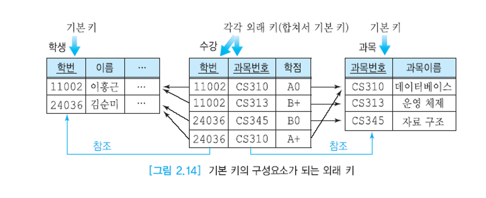

# 리서치

## 복합키

여러 열을 조합하여 기본키 역할을 할 수 있게 만든 키.  
하나의 열만으로 행을 식별하는 것이 불가능하여 두 개 이상의 열 값을 함께 사용해야 각 행이 유일한 데이터로서 가치를 가지게 된다.



아래 처럼 테이블을 설정해주는게 맞는지는 모르겠다.

```sql
create table attend
(
    grade      varchar(10) not null,
    student_id varchar(20) not null,
    subject_id varchar(20) not null,
    primary key (student_id, subject_id),
    constraint attend_student_id_fk
        foreign key (student_id) references student (id),
    constraint attend_subject_id_fk
        foreign key (subject_id) references subject (id)
);


-- auto-generated definition
create table student
(
    id   varchar(20) not null,
    name varchar(20) not null,
    constraint student_id_uindex
        unique (id)
);

alter table student
    add primary key (id);


-- auto-generated definition
create table subject
(
    id   varchar(20) not null,
    name varchar(20) not null,
    constraint subject_id_uindex
        unique (id)
);

alter table subject
    add primary key (id);

```

