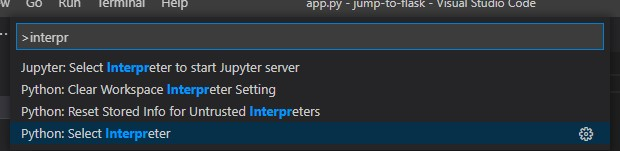
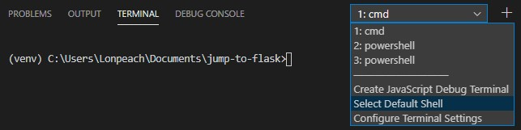
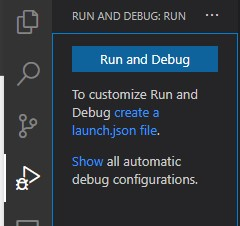

# 기본 세팅

개인적으로 사용하다 보니 IDE의 경우 파이참이 더 좋은 것 같다.

하지만 무료로 사용한다면 그래도 역시 VSCode가 최고인것 같다.

가볍고, 빠르고, 다양한 확장 기능들을 제공한다.

설치 확장 기능

* Python \(파이썬 기본 자동완성\)
* Pylance \(자동완성 강화\)
* GitHub Pull Requests and Issues

위 확장 기능을 설치하면, 자동 완성 부분은 거의 완벽하게 동작한다고 생각해도 무방하다.

## VSCode 설정

### VSCode 파이썬 가상환경 설정

* 각 프로젝트마다 새로운 가상환경을 만들어, 가상 환경에서 필요한 패키지를 설치하여 실행하는 방법
* VSCode에서 해당 가상환경을 설치 및 설정하는 방법
* VSCode에서 터미널을 열고 \(ctrl+\`\) 아래 명령어 실행

```bash
python -m venv venv # 맨 끝의 venv는 원하는 이름으로 변경 가능
```

* 해당 venv 폴더는 따로 관리를 할 필요 없는 폴더 이기 때문에 gitignore에 추가하자.



해당 터미널을 열면 경로 앞에 가상환경의 이름이 나오면 성공.

UnauthorizedAccess 에러 발생시 아래 2가지 방법 중 하나를 선택해서 해결 가능

1. 터미널 기본 쉘을 cmd로 변경
2. powershell을 사용하고 싶을 경우. 파워셀을 관리자 권한으로 열고  `Set-ExecutionPolicy RemoteSigned` 명령어 실행



### Flask 기본 세팅

* settings.json 파일에 `"python.languageServer": "Pylance"` 추가
* `pip install flask` 실행


```python
# save this as app.py
from flask import Flask, escape, request

app = Flask(__name__)

@app.route('/')
def hello():
    name = request.args.get("name", "World")
    return f'Hello, {escape(name)}!'
```


* [플라스크 홈페이지의 공식 예제](https://palletsprojects.com/p/flask/)
* 터미널에서`flask run` 명령어로 실행 하는게 정석이나, VSCode에서는 아래 방법으로 launch.json 파일을 만들고 단축키로 실행 가능하다.



* 오른쪽 아이콘 Run & Debug 버튼을 누르고 create a launch.json file 클릭 후 flask 선택
* ctrl+f5로 실행 가

```bash
 * Serving Flask app "app.py" (lazy loading)
 * Environment: development
 * Debug mode: on
 * Restarting with stat
 * Running on http://127.0.0.1:5000/ (Press CTRL+C to quit)
127.0.0.1 - - [09/Apr/2021 00:11:15] "GET / HTTP/1.1" 200 -
127.0.0.1 - - [09/Apr/2021 00:11:16] "GET /favicon.ico HTTP/1.1" 404 -
```

* [http://localhost:5000/](http://localhost:5000/) 접속 확인

## 참조

* [https://wikidocs.net/book/4542](https://wikidocs.net/book/4542)
* [https://flask.palletsprojects.com/en/1.1.x/](https://flask.palletsprojects.com/en/1.1.x/)


