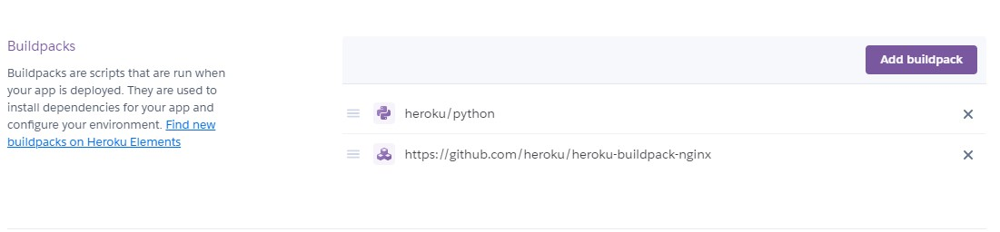

# Heroku에 배포하기

## 목적

* 단순한 앱\(ping request를 보내면, pong을 response\)을 Heroku 서비스에 배포

## Heroku

흔한 pass 서비스. 예전에는 hot 했던 것 같은데, 요즘에 이걸 사용한다는 사람은 못본것 같다.

왜 Heroku에 배포하려고 하는가? 학습 목적이 강하다. 여러가지 서비스들을 한번씩은 사용해 보면 도움이 될 것으로 보인다.

가입 부분은 생략 \(이미 가입이 되어 있는 상태\)

### 절차

* heroku cli 툴 설치
* cmd 창에서 아래 명령어 실행

```bash
$ heroku login
heroku: Press any key to open up the browser to login or q to exit
 ›   Warning: If browser does not open, visit
 ›   https://cli-auth.heroku.com/auth/browser/***
heroku: Waiting for login...
Logging in... done
Logged in as me@example.com
```

* heroku login인데 위 처럼 실행하면 브라우저가 원래 나와야 되는 것으로 보이는데 나오지 않음. `heroku login -i` 명령어를 사용하여 아이디 및 비밀번호 입력 후 로그인


* 앱 준비

```bash
git clone https://github.com/heroku/python-getting-started.git
cd python-getting-started
```

* heroku에서 미리 준비한 장고 앱

```bash
$ heroku create
Creating app... done, ⬢ serene-caverns-82714
https://serene-caverns-82714.herokuapp.com/ | https://git.heroku.com/serene-caverns-82714.git
```

* 앱을 만들고 배포 하는 과정

```bash
$ git push heroku main
Counting objects: 407, done.
Delta compression using up to 8 threads.
Compressing objects: 100% (182/182), done.
Writing objects: 100% (407/407), 68.65 KiB | 68.65 MiB/s, done.
Total 407 (delta 199), reused 407 (delta 199)
remote: Compressing source files... done.
remote: Building source:
remote:
remote: -----> Python app detected
remote:        https://serene-caverns-82714.herokuapp.com/ deployed to Heroku
remote:
remote: Verifying deploy... done.
To https://git.heroku.com/serene-caverns-82714.git
 * [new branch]      revert-to-requirements -> main
 
```

* 앱 실행 중인지 확인

```bash
heroku ps:scale web=1
```

* 앱 사이트 오픈

```bash
heroku open
```

## Flask

기존 `flask run` 등을 사용하여 서버를 띄우는 방식은 개발 용도로 실제 서비스에는 적합하지 않다.

Gunicorn + Nginx 등을 사용하여 서버를 구성 해야 한다.

Heroku의 경우 Nginx를 띄우는 것을 추천하지 않고 있지만, Gunicorn의 경우 Nginx를 사용하여 프록시 서버를 구성하는 것을 추천하고 있다. 일반적으로 다른 서비스 \(aws\)등에서는 flask + Nginx + Gunicorn의 조합으로 Flask 앱을 실행한다.

Heroku 자체가 비싼 돈을 주고 쉽게 배포하려고 만든 서비스로 보이는데, 생각 보다 삽질을 많이 했다.

열심히 세팅을 해서, Heroku에서 해당 조합으로 Flask 앱을 실행할 수 있도록 하였는데, 생각해보니 원래 목적이 RESTful API를 만드는 것이었고, 굳이 정적 웹서버가 필요 없는 상황이었다. 그래도 뭐 한번 진행했으니.. 다음에 필요한 경우에는 조금 더 쉽게 진행할 수 있을 것으로 보인다.

Nginx 설정을 위해 HeroKu의 앱 Settings에서 Buildpacks를 설정한다.

* [https://github.com/heroku/heroku-buildpack-nginx](https://github.com/heroku/heroku-buildpack-nginx)




```text
app
L __init__.py
Procfile
requirements.txt
```



```bash
  web: bin/start-nginx gunicorn -c config/gunicorn.conf.py "app:create_app()"
```


* bin/start-nginx로 nginx를 실행시킨다.
* gunicorn -c config/gunicorn.conf.py로 Gunicorn 설정 파일을 실행한다.
* app:create\_app\(\) 명령어로 Flask 앱을 실행한다.


```text
def when_ready(server):
    open("/tmp/app-initialized", "w").close()


bind = "unix:///tmp/nginx.socket"
```



```text
daemon off;
# Heroku dynos have at least 4 cores.
worker_processes <%= ENV['NGINX_WORKERS'] || 4 %>;

events {
	use epoll;
	accept_mutex on;
	worker_connections <%= ENV['NGINX_WORKER_CONNECTIONS'] || 1024 %>;
}

http {
	gzip on;
	gzip_comp_level 2;
	gzip_min_length 512;

	server_tokens off;

	log_format l2met 'measure#nginx.service=$request_time request_id=$http_x_request_id';
	access_log <%= ENV['NGINX_ACCESS_LOG_PATH'] || 'logs/nginx/access.log' %> l2met;
	error_log <%= ENV['NGINX_ERROR_LOG_PATH'] || 'logs/nginx/error.log' %>;

	include mime.types;
	default_type application/octet-stream;
	sendfile on;

	# Must read the body in 5 seconds.
	client_body_timeout 5;

	upstream app_server {
		server unix:/tmp/nginx.socket fail_timeout=0;
	}
    
    # 서버 설정 정리 필요.
    # ^~ 변경자를 갖는 location 블럭의 시작 부분과 일치
	server {
		listen <%= ENV["PORT"] %>;
        server_name sleepy-wildwood-81398.herokuapp.com default_server;
		keepalive_timeout 5;
        
        location = /favicon.ico { access_log off; log_not_found off; }
        
        # static
        location /static {
            alias /app/app/static;
        }
        
        # static 이외에는 모두 gunicorn이 처리 한다.
        location / {
            proxy_set_header X-Real-IP $remote_addr;
            proxy_set_header X-Forwarded-For $proxy_add_x_forwarded_for;
            proxy_set_header Host $server_name;
            proxy_redirect off;
            proxy_pass http://app_server;
        }

        # api로 시작하면 모두 gunicorn이 처리한다.
        # location ^~ /api {
        # }
	}
}
```


* nginx 설정 파일을 세팅한다. 
  * [https://github.com/heroku/heroku-buildpack-nginx](https://github.com/heroku/heroku-buildpack-nginx) 의 설정 파일을 복사하여 자신의 상황에 맞게 수정한다.



## 참조

* [https://flask.palletsprojects.com/en/1.1.x/deploying/\#deployment](https://flask.palletsprojects.com/en/1.1.x/deploying/#deployment)
* [https://devcenter.heroku.com/articles/getting-started-with-python](https://devcenter.heroku.com/articles/getting-started-with-python)
* [https://gunicorn.org/](https://gunicorn.org/)
* [https://eserdk.medium.com/heroku-nginx-gunicorn-flask-f10e81aca90d](https://eserdk.medium.com/heroku-nginx-gunicorn-flask-f10e81aca90d) 

