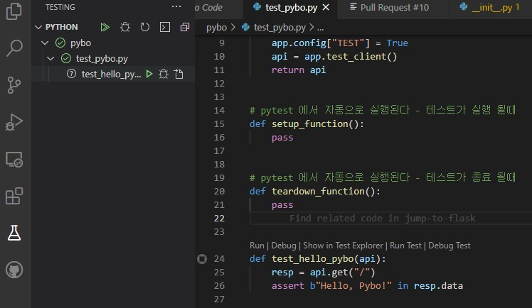

# 유닛 테스트

RESTful API의 경우 각 동작이 어떤 역할을 하는지 정확히 명시 되므로, 유닛 테스트를 잘 활용할 수 있을 것으로 보인다.

파이썬에서는 다양한 유닛 테스트 툴이 있지만, pytest가 가장 유명하고, 쉽게 테스트를 만들 수 있는 것으로 보인다.


```python
# pylint: disable=redefined-outer-name
import pytest
from pybo import create_app


@pytest.fixture
def api():
    app = create_app()
    app.config["TEST"] = True
    api = app.test_client()
    return api


# pytest 에서 자동으로 실행된다 - 테스트가 실행 될때
def setup_function():
    pass


# pytest 에서 자동으로 실행된다 - 테스트가 종료 될때
def teardown_function():
    pass


def test_hello_pybo(api):
    resp = api.get("/")
    assert b"Hello, Pybo!" in resp.data

```


* 유닛 테스트 파일 명 및 함수 명은 test\_ 접두어가 붙어야 한다.
* 플라스크에서는 테스트 클라이언트를 제공한다.
* setup, teardown 등으로 테스트 실행 전 후 세팅을 할 수 있다. \(test DB 세팅 등\)
* `@pytest.fixture`로 설정된 값은 pytest에서 자동으로 inject 시켜준다.



